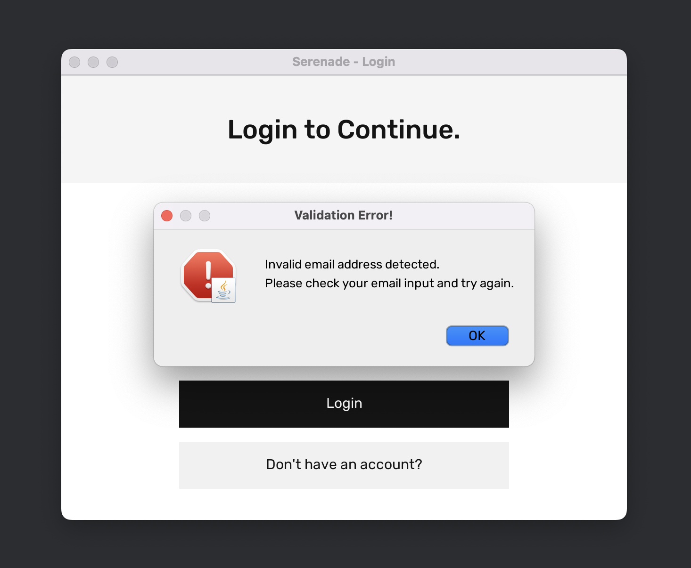
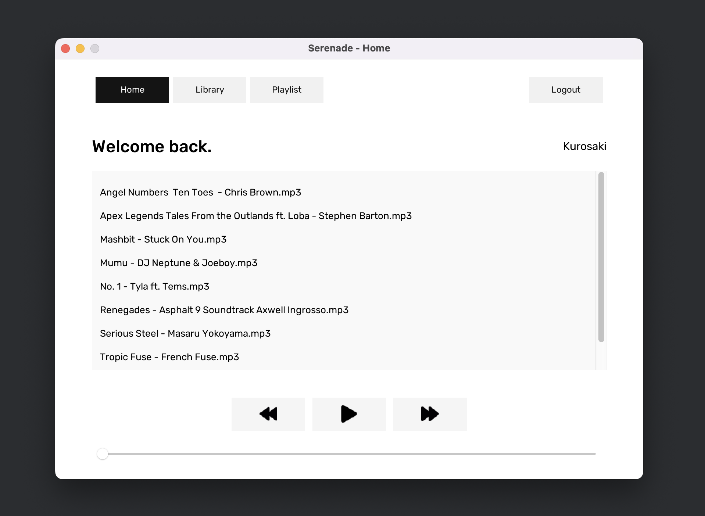
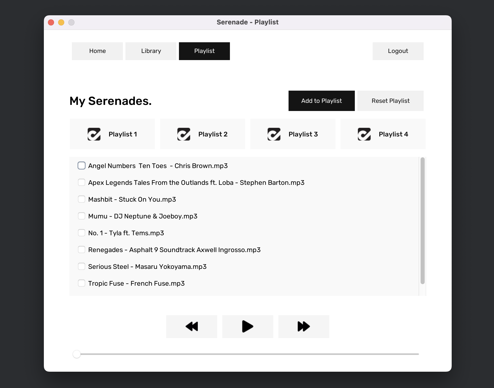

## Serenade v3.
Serenade is your one-stop shop for all things auditory bliss. Think of it as 
your personal jukebox on steroids – sleek, modern, and overflowing with 
features that will have you singing in the shower (or, you know, wherever 
your musical urges take you).

This is intended to be the final product after several iterations i.e. v1 and v2.

### Features
- Revamped UI/UX
- Added a Welcome / Splash GUI
- Added a Login GUI with input validations
- Added a Register GUI with input validations
- Added a Home GUI with music playing & listings capabilities
- Added a Library GUI with searching & validation capabilities 
- Added a Playlist GUI with saving, and music playing functions.

### Technology Stack
- Java
- JLayer, Mp3Magic, JAudioTagger
- SQLITE DB

### How to Use
- Download or clone this repository and extract the contents to your desktop.
- Open the project using your IDE of choice. We heavily recommend **IntelliJ IDEA**
- Download some sample music from the Google Drive link: https://drive.google.com/file/d/1jw9OjZivAhTlxo4PWEDd3TTLaib-Kv1J/view?usp=drive_link
- Extract and copy the contents of the sample music and paste them in the project's music directory:
```
 src/assets/music
```
- Download the following JAR files and follow the instructions below to add them to the project. (**NB: Skip this step if the lib and JAR files already exist**)
```
https://jar-download.com/artifacts/com.mpatric/mp3agic/0.9.0/source-code
```
```
https://jar-download.com/artifacts/javazoom/jlayer/1.0.1/source-code
```
```
https://jar-download.com/artifact-search/jaudiotagger
```
- Extract all JAR files into a directory in the root folder called **lib**
- Add the JAR files to the **Project Structure** (CTRL+ALT+SHIFT+S in IntelliJ)
- Click on **Modules**, then the **+** icon and select the **JARs or Directories**
- Locate the lib folder within the project and select all 3 JAR files.
- Click **OK** then **APPLY** then **OK**. And that's it!
- Install SQLITE following the instruction from their site

### Team Members
- Njoku Richard 
- Arnold Aijuka
- Moses Muta
- Sarah Muriithi

### Screenshots



